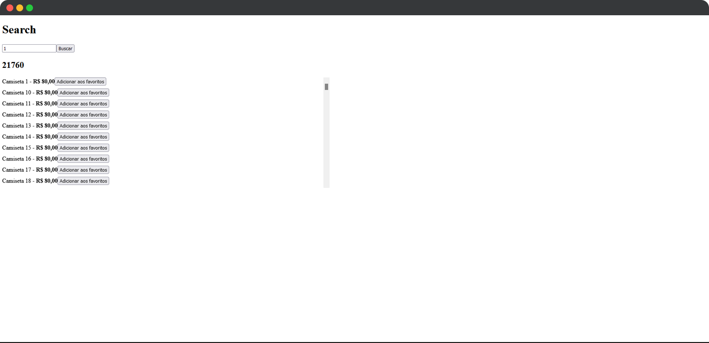

<h1 align="center">
  PerfoReact
</h1>

<p align="center">
  

  
</p>

<br>

<p align="center">
  
</p>

<br>

## 🧪 Tecnologias

Esse projeto foi desenvolvido com as seguintes tecnologias:

- [React](https://reactjs.org)
- [NextJS](https://nextjs.org/)
- [react-virtualized](https://github.com/bvaughn/react-virtualized)
- [TypeScript](https://www.typescriptlang.org/)

## 💻 Projeto

O projeto tem como objetivo o estudo e desenvolvimento de uma aplicação em NextJS com estratégias de performances dentro do React.

PerfoReact foi desenvolvido estudando como performar aplicações com React utilizando o memo, useMemo e useCallback e ferramentas complementares tais como a extensão React Developer Tools, a biblioteca react-virtualized que nos permite renderizar o html somente do que estiver visível conforme a barra de rolagem, estratégia Code Splitting (lazy no React, ou dynamic no NextJS) que serve para uma importação ser realizada somente quando ela for utilizada e o Bundle Analyzer, que oferece o propósito de analisar o tamanho de tudo que compõe a build.

Este é um projeto desenvolvido como prática das aulas do Chapter V da trilha ReactJS do **[Programa Ignite](https://www.rocketseat.com.br/ignite)** da Rocketseat.

## 🚀 Como executar

Clone o projeto e acesse a pasta do mesmo.

```bash
$ git clone https://github.com/rafaelramosdev/perforeact
$ cd perforeact
```

Para iniciá-lo, siga os passos abaixo:

```bash
# Instala as dependências
$ yarn

# Inicia o json-server
$ yarn server

# Inicia o website
$ yarn dev
```

O website estará disponível no seu navegador pelo endereço [`http://localhost:3000`](http://localhost:3000).

## 📄 Licença

Esse projeto está sob a licença MIT. Veja o arquivo [LICENSE](LICENSE) para mais detalhes.

---

Feito by [Rafael Ramos](https://rafaelramos.dev/) 🙋🏻‍♂️
